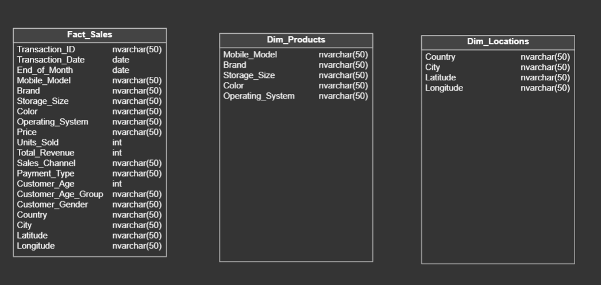
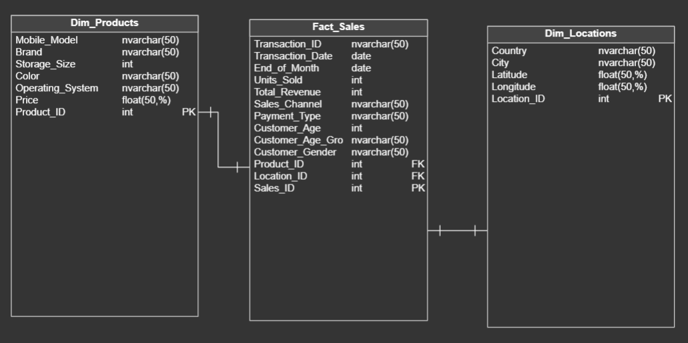
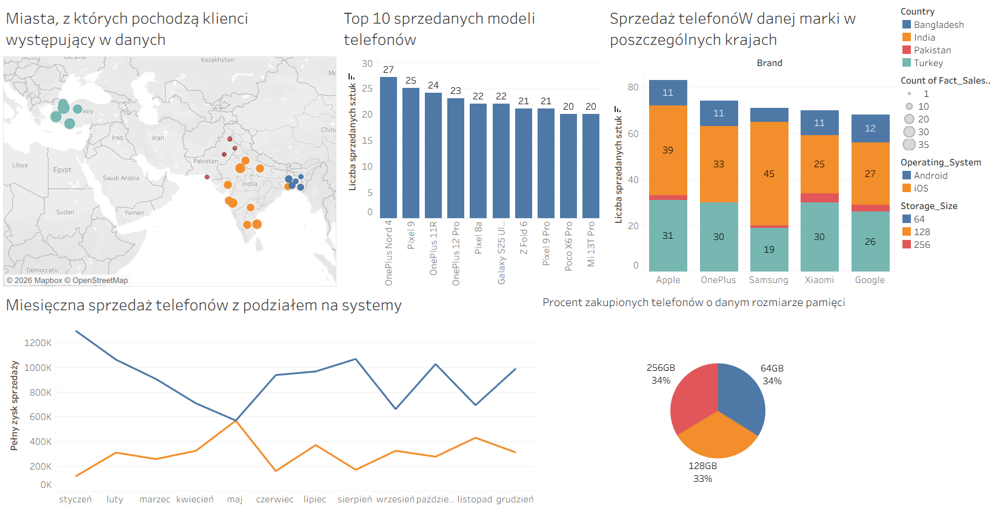

# Analiza Sprzedaży Telefonów Komórkowych
## Cel projektu 
Celem projektu była dogłębna analiza sprzedaży telefonów, przy czym odpowiedziano na takie pytania jak: w których miastach sprzedawana jest największa ilość telefonów oraz skąd pochodzą klienci, które marki w jakich państwach się najbardziej sprzedają, który system oraz rozmiar pamięci telefonu jest bardziej pożądany i które modele się najbardziej sprzedają.

## Wykorzystane technologie
- SQL Server
- Tableau

## Architektura danych
Dane składają się z 3 tabel, które przed przetworzeniem wyglądały następująco:

gdzie kolumny przedstawiały następująco informacje:
- Transaction_ID - Unique transaction ID
- Transaction_Date - Date the transaction occurred
- Mobile_Model - Model of the smartphone sold
- Brand - Smartphone brand
- Price - Price of the smartphone
- Units_Sold - Units sold in transaction
- Total_Revenue - Total revenue (Price * Units Sold)
- Customer_Age - Customer's age
- Customer_Age_Group - Age group bucket
- Customer_Gender - Customer's gender
- Country - Country of transaction
- City - City of transaction
- Latitude - City's latitude
- Longitude - City's longitude
- Sales_Channel - Sales channel used
- Payment_Type - Method of payment
- End of Month - Month-end date for aggregation
- Storage_Size - Device storage configuration
- Color - Color variant of the device
- Operating_System - Operating system of the phone

## Przetwarzanie danych
W celu przetworzenia danych wykonano następujące operacje na tabelach:

**Tabela Fact_Sales**
- Usunięto powtarzające się w innych tabelach kolumny (m.in. Brand, Color, City, itd.)
- Usunięto kolumnę Customer_Age_Group
- Dodano klucz główny Sales_ID
- Dodano klucze obce z innych tabel (Product_ID i Location_ID)

**Tabela Dim_Products**
- Dodano kolumnę Price z tabeli głównej
- Zmieniono typ danych w kolumnach Storage_Size oraz Price
- Dodano klucz główny Product_ID
- Uzupełniono brakujące ceny danej kombinacji modeli, koloru i pamięci biorąc średnią cenę tych samych modeli o innych kolorach i rozmiarach pamięci

**Tabela Dim_Locations**
- Zmieniono typ danych w kolumnach Latitude oraz Longitude
- Dodano klucz główny Location_ID

Ostatecznie tabele prezentowały się w następujący sposób

## Dashboard oraz wnioski

Na podstawie przeprowadzonej analizy oraz wizualizacji można wyciągnąć następujące wnioski:
- Modelem najczęściej sprzedawanym jest OnePlus Nord 4
- Najczęściej sprzedawaną marką telefonu jest Apple
- Najwięcej telefonów sprzedaje się w Indiach
- Zapotrzebowanie na każdy wymieniony rozmiar pamięci (64GB, 128GB, 256GB) jest równomierne
- Częściej wybieranym systemem telefonu jest Android, natomiast iOS nie jest daleko za nim